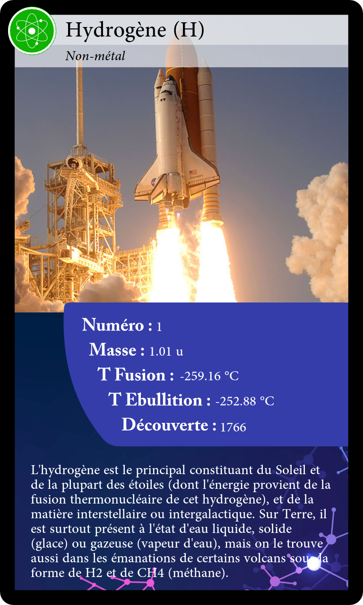

Atom tradecards
===================



This project create trade cards based on atom metadata from the periodic table.

Quickstart
----------

1. Create and activate virtual environment
```bash
python3 -m venv .venv
source .venv/bin/activate
```

2. Install all required packages
```bash
pip install -r requirements.txt
```

3. Generate one card image per atom based on the atom metadata inside the CSV
```bash
python3 generate_cards_from.csv
```
(the images are saved inside `./outputs`)

4. Generate PDF paper sheet so that it is easy to print all the cards
```bash
python3 generate_printing_cards.csv
```
(the PDF is generated inside `./outputs/sheets/all.pdf`)

Project structure
-----------------

```bash
.
├── README.md
├── assets                       # all data
│   ├── background.png              # card background
│   ├── front.png                   # card front
│   ├── img                         # atom images
│   ├── periodic_table_atoms.csv    # atom CSV metadata
│   ├── picto.png                   # card picto
│   └── tradecard_atom.afdesign     # affinity designer file for card design
├── doc                          # documentation assets
├── generate_card.py
├── generate_cards_from_csv.py
├── generate_printing_cards.py
├── requirements.txt
└── utils.py
```
